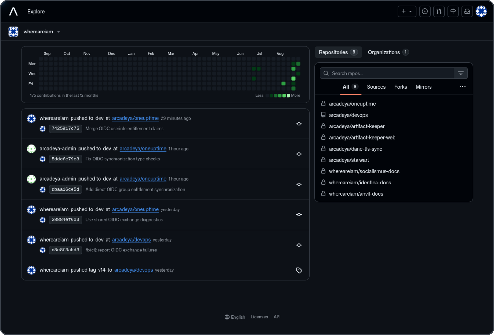

<h1 align="center">
  <p>Forgejo GitHub Theme</p>
  
  
  
  
</h1>

<h4 align="center">

A Forgejo theme that pursues GitHub style not only in colors but also in styling details.

</h4>



## Compatibility

This project is a Forgejo-focused fork of [Gitea GitHub Theme](https://github.com/lutinglt/gitea-github-theme). It
retains the upstream theme engine and design system while adapting styles and templates to Forgejo's native markup.

The standard `bun bundle` command generates all themes in `dist`; generated CSS remains excluded from Git. The included
templates are version-bound and should not be installed on another Forgejo release without reviewing its routes and
template data.

Releases are not tied to a Forgejo version number. Each release states the supported Forgejo major version and the exact
Forgejo version used for testing in its release notes.

This project is licensed under the Apache License 2.0. See [LICENSE](LICENSE) and [NOTICE](NOTICE) for the upstream
copyright and attribution information.

## Installation

> [!IMPORTANT]
>
> Because the project uses new CSS features, ensure styles are applied correctly by keeping Chrome/Edge >= 120,
> Firefox >= 121, Safari >= 16.5

Choose one of the following ways to obtain the assets:

- Download the packaged archives from the [latest release](https://github.com/whereareiam/forgejo-github-theme/releases/latest).
- Run the [Development Build](https://github.com/whereareiam/forgejo-github-theme/actions/workflows/development-build.yml)
  workflow manually and download its artifact.
- Build the assets locally with the commands in [Using the Development Version](#using-the-development-version-of-the-theme).

Install the resulting files using your Forgejo data directory (commonly `data/gitea` in the official container):

1. Extract the CSS archive(s), then place the contained `*.css` files in `<forgejo-data>/public/assets/css` (create the
   directory if necessary).
2. Extract `theme-github-fonts.tar.gz` into `<forgejo-data>/public`. This supplies the Mona Sans variable font; its SIL
   Open Font License is included beside the font.
3. Extract the optional `theme-github-templates.tar.gz` archive into `<forgejo-data>`.
4. Modify `<forgejo-data>/conf/app.ini` and append the CSS filename without the `theme-` prefix to `THEMES` under
   the `[ui]` section.
5. Restart Forgejo.
6. Select the theme in the Forgejo settings.

Example: If the theme filename is `theme-github-dark.css`, add `github-dark` to the end of `THEMES`

Example `<forgejo-data>/conf/app.ini`:

```ini
[ui]
THEMES = gitea-auto, gitea-light, gitea-dark, github-auto, github-light, github-dark, github-soft-dark
```

> [!TIP]
>
> When `THEMES` is not set, Forgejo will use all themes

> [!IMPORTANT]
>
> Automatic color theme requires both light and dark theme files.

For details, refer to the [Forgejo documentation](https://forgejo.org/docs/latest/administration/customizing-gitea/).

### Template File Installation (Optional)

> [!IMPORTANT]
>
> The template modifies Forgejo's layout to make it closer to GitHub's layout. Do not use template files across versions,
> as this may lead to missing functionality, Forgejo failing to start, and other issues.
>
> Template layout is bound to the Forgejo instance and will affect all themes, impacting the experience of other
> non-project themes.

1. Download the latest template archive from the release page and extract it into `<forgejo-data>`.
2. Restart Forgejo

## Screenshots

### Default Themes

```ini
THEMES = github-auto, github-light, github-dark, github-soft-dark
```

<details>
<summary>Default</summary>
<h4>theme-github-light.css</h4>

<h4>theme-github-dark.css</h4>

<h4>theme-github-soft-dark.css</h4>

</details>

### Colorblind Themes (Beta)

```ini
THEMES = github-colorblind-auto, github-colorblind-light, github-colorblind-dark
THEMES = github-tritanopia-auto, github-tritanopia-light, github-tritanopia-dark
```

<details>
<summary>Colorblind & Tritanopia</summary>
<h4>theme-github-colorblind-light.css & theme-github-tritanopia-light.css</h4>

<h4>theme-github-colorblind-dark.css & theme-github-tritanopia-dark.css</h4>

</details>

### HighContrast Themes

```ini
THEMES = github-high-contrast-auto, github-high-contrast-light, github-high-contrast-dark, github-high-contrast-soft-dark
```

<details>
<summary>HighContrast</summary>
<h4>theme-github-high-contrast-light.css</h4>

<h4>theme-github-high-contrast-dark.css</h4>

<h4>theme-github-high-contrast-soft-dark.css</h4>

</details>

### HighContrast Colorblind Themes ( Beta )

```ini
THEMES = github-high-contrast-colorblind-auto, github-high-contrast-colorblind-light, github-high-contrast-colorblind-dark
THEMES = github-high-contrast-tritanopia-auto, github-high-contrast-tritanopia-light, github-high-contrast-tritanopia-dark
```

<details>
<summary>HighContrast Colorblind & Tritanopia</summary>
<h4>theme-github-high-contrast-colorblind-light.css & theme-github-high-contrast-tritanopia-light.css</h4>

<h4>theme-github-high-contrast-colorblind-dark.css & theme-github-high-contrast-tritanopia-dark.css</h4>

</details>

### Pink Themes

```ini
THEMES = github-pink-auto, github-pink-light, github-pink-dark, github-pink-soft-dark
```

<details>
<summary>Pink</summary>
<h4>theme-github-pink-light.css</h4>

<h4>theme-github-pink-dark.css</h4>

<h4>theme-github-pink-soft-dark.css</h4>

</details>

### Gitea-Compatible Themes

```ini
THEMES = github-gitea-auto, github-gitea-light, github-gitea-dark
```

<details>
<summary>Gitea-compatible</summary>
<h4>theme-github-gitea-light.css</h4>

<h4>theme-github-gitea-dark.css</h4>

</details>

### Catppuccin Themes

```ini
THEMES = github-catppuccin-auto, github-catppuccin-latte, github-catppuccin-frappe, github-catppuccin-macchiato, github-catppuccin-mocha
```

<details>
<summary>Catppuccin</summary>
<h4>theme-github-catppuccin-latte.css</h4>

<h4>theme-github-catppuccin-frappe.css</h4>

<h4>theme-github-catppuccin-macchiato.css</h4>

<h4>theme-github-catppuccin-mocha.css</h4>

</details>

## Custom CSS Variables

You can customize parts of the theme style according to your preferences

### Usage Method

Add the following code at the beginning or end of the theme's CSS file

```css
:root {
  --custom-clone-menu-width: 150px;
  ...
}
```

> [!IMPORTANT]
>
> Please ensure to add custom variables in the `:root` selector, otherwise they will not take effect
>
> Variables are separated by `;`
>
> It is recommended to place custom variables in a separate file and append them to the theme file using shell commands
> or other methods

### CSS Variables

| Variable Name                     | Description                                              | Default | Github | Recommend | Min   | Max   |
| :-------------------------------- | :------------------------------------------------------- | :------ | :----- | :-------- | :---- | :---- |
| --custom-branch-menu-width        | Branch menu width                                        | 320px   | 320px  | 320px     | Gitea | 640px |
| --custom-clone-menu-width         | Clone button menu width                                  | Gitea   | 332px  | 200px     | 150px | 400px |
| --custom-user-menu-width          | User menu width                                          | 192px   | 200px  |           | Gitea | 320px |
| --custom-explore-repolist-columns | Number of repository list columns on explore page        | 2       | 2      | 2         |       |       |
| --custom-explore-userlist-columns | Number of user/organization list columns on explore page | 3       | 1      | 2/3       |       |       |
| --custom-user-repolist-columns    | Number of repository list columns on user page           | 2       | 2      | 1/2       |       |       |
| --custom-org-repolist-columns     | Number of repository list columns on organization page   | 1       | 1      | 1/2       |       |       |
| --custom-org-userlist-columns     | Number of user list columns on organization page         | 2       | 1      | 1/2       |       |       |

## Using the Development Version of the Theme

You might want to use the development version of the theme instead of the released version.

Please ensure you have Bun 1.3.14 or above installed.

```bash
git clone https://github.com/whereareiam/forgejo-github-theme.git
cd forgejo-github-theme
bun install
bun bundle
```

After compilation, CSS files are generated in `dist`. Install them as described above. The full release packaging step,
including templates and fonts, is available through the repository's CI workflow.
